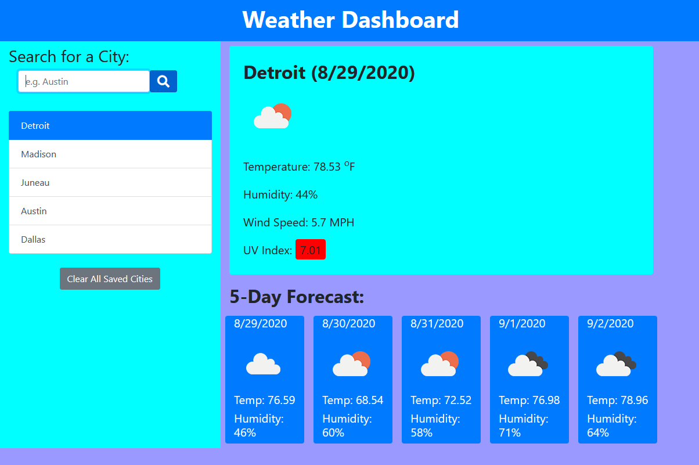

# UTA-H6-Weather-Dashboard-AAS
Weather dashboard app that uses OpenWeather API to retrieve weather data for user-inputted cities.

### This repository contains the code files for the sixth homework assignment for the UT-Austin Coding Bootcamp.

---

## Assignment
>Third-party APIs allow developers to access their data and functionality by making requests with 
>specific parameters to a URL. Your challenge is to build a weather dashboard that will run in 
>the browser and feature dynamically updated HTML and CSS.

>AS A traveler
>I WANT to see the weather outlook for multiple cities
>SO THAT I can plan a trip accordingly

---

The assignment was to build a weather dashboard that displays the current weather and 5 day weather forecast for a user-submitted city. The user-submitted city buttons, weather, and forecast content are dynamically rendered using JS and jQuery. The weather information is provided by OpenWeather's API (openweathermap.org). It is responive to multiple screen sizes and written using semantic HTML practices.

---

## Link to Deployed Application

https://abraspin.github.io/Weather-Dashboard/

---

## Example

---

## Contents
**Files include:**
* Index page
* Index JavaScript file
* This README file
* Assignment Parameters
* Sample Screenshot of App 

---

## Team
Author: Abraham Spindel

---

## Credits
* JQuery Library  
* Bootstrap Framework
* Font Awesome by Dave Gandy - http://fontawesome.io
* Open Weather - https://openweathermap.org
---

## Badges

---

## License
Openweather.org: Creative Commons Attribution-ShareAlike 4.0 International licence (CC BY-SA 4.0)  
JQuery, Bootstrap: MIT License
